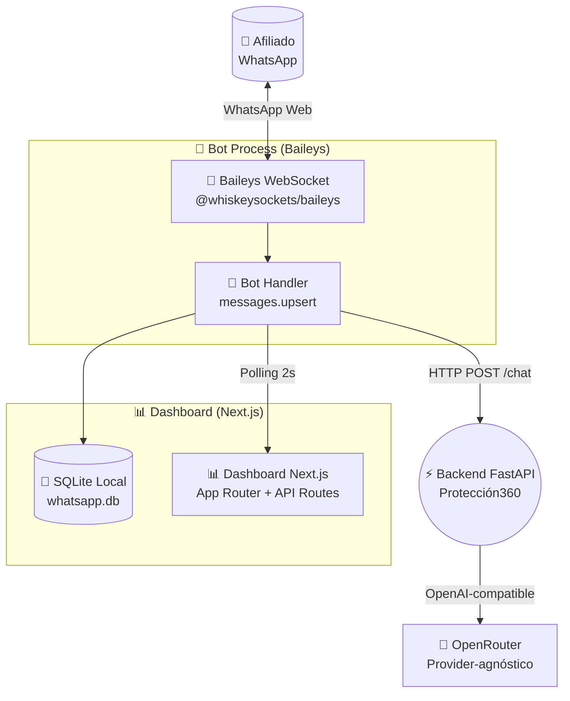
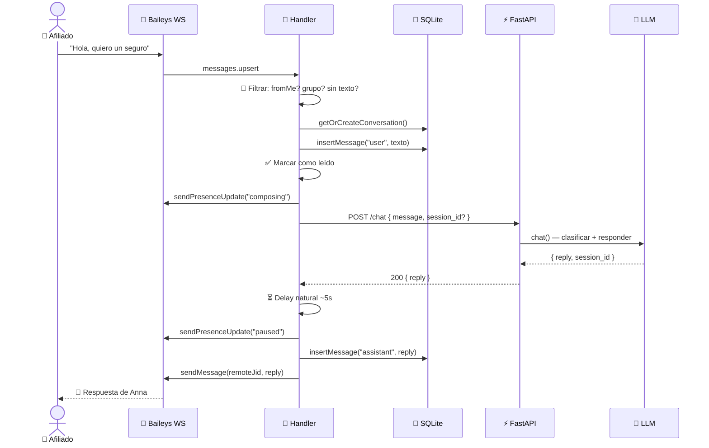
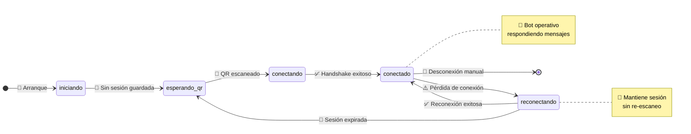
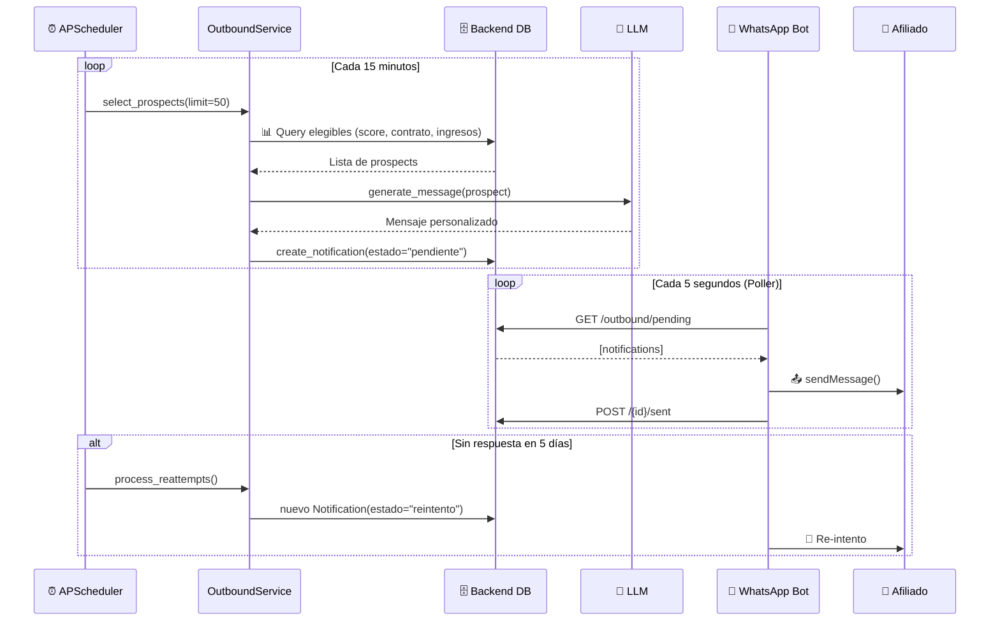

# 🤖 Reto30X — Agente WhatsApp con IA + Dashboard

<p align="center">
  <b>Bot de WhatsApp inteligente potenciado por IA — Protección360 Colsubsidio</b>
  <br>
  <i>「 Conecta tu número real sin APIs de Meta ni Twilio 」</i>
</p>

<p align="center">
  
  
  
  
  <br>
  
  
  
</p>

---

## 🏗️ Arquitectura

### Visión General



### 🗺️ Flujo de un Mensaje



### 🔄 Ciclo de Conexión



---

## 🚀 Instalación

### 📦 Requisitos

| Recurso | Versión | Comando |
|---------|:-------:|---------|
| 📦 pnpm | 9+ | `corepack enable && corepack prepare pnpm@9.15.4 --activate` |
| 📜 Node.js | >= 20.9 | `node --version` |

### 🔑 Variables de Entorno

```bash
cp .env.example .env.local
# ✏️ Edita .env.local y pon tu API key
```

| Variable | ¿Obligatoria? | Defecto | Descripción |
|----------|:-------------:|:-------:|-------------|
| `LLM_API_KEY` | ✅ Sí | — | 🔑 API key del provider (OpenRouter, OpenAI, Groq...) |
| `LLM_MODEL` | ❌ No | `openai/gpt-4o-mini` | 🧠 Modelo LLM a usar |
| `LLM_BASE_URL` | ❌ No | `https://openrouter.ai/api/v1` | 🔗 Endpoint del provider |
| `BACKEND_API_URL` | ❌ No | `http://localhost:8000` | ⚡ URL del backend FastAPI |
| `MCP_SERVER_URL` | ❌ No | `http://localhost:9000/mcp` | 🔌 URL del servidor MCP |

> 🔌 **Provider-agnóstico:** Funciona con **cualquier** proveedor OpenAI-compatible:
> ```bash
> # OpenRouter (default) → LLM_API_KEY=sk-...   + LLM_BASE_URL=https://openrouter.ai/api/v1
> # OpenAI              → LLM_API_KEY=sk-...    + LLM_BASE_URL=https://api.openai.com/v1
> # Groq                → LLM_API_KEY=gsk_...   + LLM_BASE_URL=https://api.groq.com/openai/v1
> # Ollama (local)      → LLM_API_KEY=ollama    + LLM_BASE_URL=http://localhost:11434/v1
> ```

> ⚠️ Los modelos con sufijo `:free` en OpenRouter tienen rate limits de **50 requests/día** sin créditos. En producción recomiendo `openai/gpt-4o-mini`.

### 🤖 Iniciar el Bot

```bash
# Terminal 1 — Bot WhatsApp (Baileys)
pnpm run start:bot

# Terminal 2 — Dashboard Next.js
pnpm dev

# Producción (ambos juntos)
pnpm run start:all
```

### 📋 Flujo de Conexión

1. **📸 Escaneá el QR** desde el dashboard (http://localhost:3000)
2. **✅ Sesión persistida** en `./auth/` — reconexiones sin re-escaneo
3. **📊 Dashboard** con lista de chats, historial y toggle IA/HUMANO
4. **💬 Respondé** mensajes manualmente en modo HUMANO

---

## 📁 Estructura del Proyecto

```
📦 Reto30X_Whatsapp/
├── 📁 src/
│   ├── 📁 app/                    # Next.js App Router + API Routes
│   │   ├── 📁 api/
│   │   │   ├── 📁 connection/     # GET status + POST disconnect
│   │   │   ├── 📁 conversations/  # GET list + DELETE by id
│   │   │   ├── 📁 messages/       # GET history + POST send
│   │   │   └── 📁 mode/           # POST toggle AI/HUMAN
│   │   ├── 📄 globals.css
│   │   ├── 📄 layout.tsx
│   │   └── 📄 page.tsx            # Dashboard principal
│   ├── 📁 components/
│   │   ├── 📄 ConnectionGate.tsx   # 🚪 Pantalla de QR / estado
│   │   ├── 📄 QRScreen.tsx         # 📸 Render de QR
│   │   ├── 📄 ConversationList.tsx # 💬 Lista de chats
│   │   ├── 📄 ConversationPanel.tsx# 🗪 Panel de conversación
│   │   ├── 📄 DashboardHeader.tsx  # 🏠 Header con info de conexión
│   │   ├── 📄 MessageBubble.tsx    # 🫧 Burbuja de mensaje
│   │   └── 📄 ModeToggle.tsx       # 🔄 Toggle IA / HUMANO
│   └── 📁 lib/
│       ├── 📁 baileys/
│       │   ├── 📄 client.ts        # 🔌 Cliente WebSocket Baileys
│       │   └── 📄 handler.ts       # 🤖 Manejador de mensajes
│       ├── 📄 api-client.ts        # 🌐 HTTP client para backend FastAPI
│       ├── 📄 db.ts                # 🗄️ SQLite helpers (better-sqlite3)
│       └── 📄 system-prompt.ts     # 📝 Carga del prompt de sistema
├── 📁 services/
│   └── 📄 outbound-poller.ts       # 📤 Poller de mensajes outbound (proactivo)
├── 📁 scripts/
│   ├── 📄 env-loader.ts            # 🔧 Carga de .env.local
│   └── 📄 start-bot.ts             # 🚀 Entry point del bot
├── 📁 agent/
│   └── 📄 system-prompt.md         # 🧠 Prompt de IA (editá este!)
├── 📁 data/                        # 💾 SQLite DB (runtime, gitignored)
├── 📁 auth/                        # 🔐 Sesión Baileys (runtime, gitignored)
├── 📄 .env.example
├── 📄 .gitignore
├── 📄 next.config.ts
├── 📄 package.json
├── 📄 pnpm-lock.yaml
├── 📄 tsconfig.json
├── 📄 postcss.config.mjs
├── 📄 Procfile
└── 📄 README.md
```

---

## 🌐 API Routes

| Método | 🔗 Ruta | 📝 Descripción |
|:------:|:--------|:---------------|
| <span style="color:green">**GET**</span> | `/api/connection/status` | 📸 Estado de conexión + QR PNG |
| <span style="color:orange">**POST**</span> | `/api/connection/disconnect` | 🔌 Desconectar y borrar sesión |
| <span style="color:green">**GET**</span> | `/api/conversations` | 💬 Lista de conversaciones |
| <span style="color:red">**DELETE**</span> | `/api/conversations/[id]` | 🗑️ Borrar conversación |
| <span style="color:green">**GET**</span> | `/api/messages/[id]` | 📜 Mensajes de una conversación |
| <span style="color:orange">**POST**</span> | `/api/messages/[id]` | ✏️ Enviar mensaje como humano |
| <span style="color:orange">**POST**</span> | `/api/mode/[id]` | 🔄 Cambiar modo AI/HUMAN |

### 💬 POST /chat (al backend FastAPI)

```json
{
  "message": "Quiero asegurar mi moto"
}
```

**✨ Respuesta:**

```json
{
  "reply": "¡Claro! Cuéntame, ¿qué marca y modelo es tu moto?",
  "session_id": "550e8400-e29b-41d4-a716-446655440000",
  "model": "gpt-4o-mini",
  "timestamp": "2026-07-23T12:00:00Z"
}
```

> 💡 **Tip:** Si no envías `session_id`, el backend crea una sesión nueva automáticamente.

---

## 📬 Mensajería Outbound (Proactiva)

El bot soporta **mensajería outbound proactiva** — el backend selecciona afiliados elegibles y genera mensajes personalizados por IA que el bot envía automáticamente.

### 🔄 Flujo Outbound



### 📡 Endpoints Outbound

| Método | 🔗 Ruta | 📝 Descripción |
|:------:|:--------|:---------------|
| <span style="color:green">**GET**</span> | `/outbound/pending` | 📬 Notificaciones pendientes de enviar |
| <span style="color:orange">**POST**</span> | `/outbound/{id}/sent` | ✅ Marcar como enviada |
| <span style="color:orange">**POST**</span> | `/outbound/{id}/responded` | 💬 Marcar como respondida |
| <span style="color:orange">**POST**</span> | `/outbound/{id}/failed` | ❌ Marcar como fallida |

---

## 🧪 Testing

```bash
# 🚀 Suite completa (331 tests)
python -m pytest

# 🎯 Tests del bot
pnpm run test        # (si aplica)

# 📊 Backend completo
cd ../Reto30X_Credit
python -m pytest backend/tests/ -v
```

---

## 🎯 Personalizar el System Prompt

Editá `agent/system-prompt.md` — es Markdown plano, sin sintaxis especial. Se recarga automáticamente sin reiniciar el bot.

---

## 🐳 Deploy (EasyPanel / Railway)

Volúmenes persistentes obligatorios:

| Volumen | Ruta | ¿Por qué? |
|:-------:|:----:|:----------|
| 📁 `data` | `/app/data` | 💾 No perder conversaciones al redesplegar |
| 📁 `auth` | `/app/auth` | 🔐 No obligar a re-escanear QR |

> ⚠️ Sin volúmenes persistentes, cada redespliegue pierde conversaciones y obliga a re-escanear el QR.

---

## 💡 Lecciones Aprendidas

| # | 🐛 Problema | ✅ Solución |
|:-:|:-----------|:------------|
| 1 | **Code 405** al conectar | Usar `fetchLatestBaileysVersion()` siempre |
| 2 | **Code 440 en loop** | Usar `Browsers.macOS('Desktop')`, no browser custom |
| 3 | **QR no aparece** | Mostrar QR si `qr_string` existe, aunque status no sea exactamente `'qr'` |
| 4 | **ENV undefined en bot** | ES module hoisting: `env-loader.ts` como primer import |
| 5 | **Procesos zombies** | Ctrl+C en Windows no mata hijos de `tsx` |
| 6 | **Node 18 default en Nixpacks** | Fijar Node 22 con `.nvmrc` + `nixpacks.toml` |

---

## 📄 Licencia

**Colsubsidio** — Uso interno. Distribución no autorizada.

---
